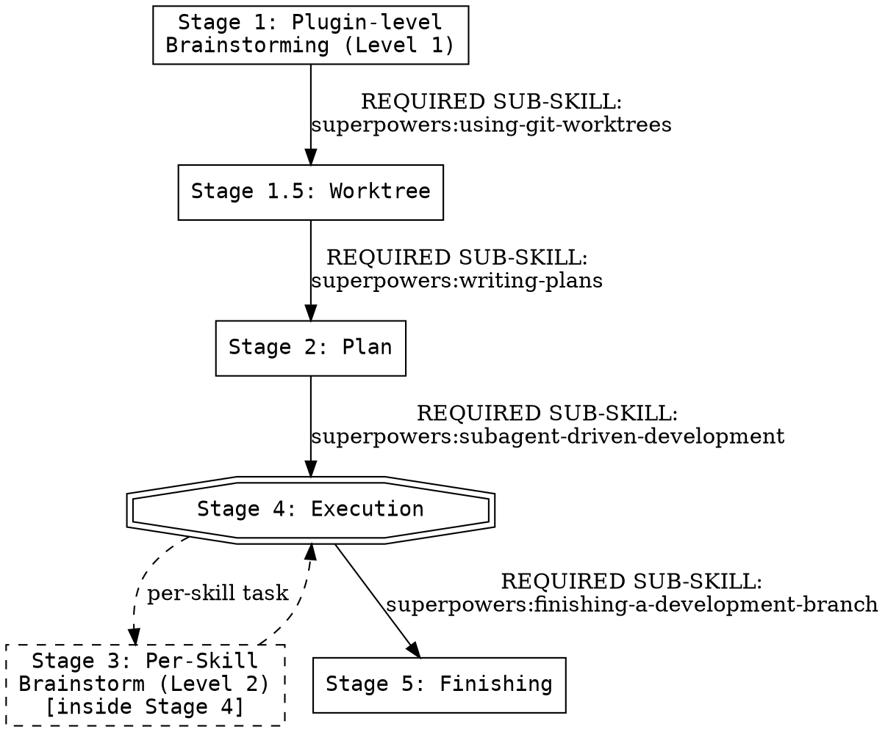

<SUBAGENT-STOP>
If you were dispatched as a subagent to execute a specific task, skip this skill.
</SUBAGENT-STOP>

<EXTREMELY-IMPORTANT>
When your human partner asks to create, build, or scaffold a plugin, you ABSOLUTELY MUST follow the canonical superpowers pipeline below. This is not negotiable. You cannot rationalize your way out of this.

A plugin is just another project. The superpowers plugin builds projects. Therefore superpowers builds the plugin. Your role is orientation: feed superpowers plugin-specific knowledge at the right stages.
</EXTREMELY-IMPORTANT>

# Creating a Plugin

## Overview

A plugin is just another project. **superpowers builds it.** This skill orients the model to invoke superpowers' canonical pipeline (brainstorm → plan → execute → finish) with plugin-specific clarifying questions, reference docs, and templates injected at each stage. It does not replace any superpowers skill.

**Violating the letter of this rule is violating the spirit of this rule.**

## The Iron Law

```
NO PLUGIN BUILT WITHOUT FOLLOWING THE FULL SUPERPOWERS PIPELINE
```

**No exceptions:**
- Don't skip Stage 1 brainstorming because "I already know what to build"
- Don't implement skills before scaffolding manifests
- Don't add a SessionStart bootstrap hook unless it was declared in the spec
- Don't compress all skills into one mega-brainstorm "to save time"
- Don't dispatch subagents without a written plan from `superpowers:writing-plans`

If you find yourself doing any of the above, STOP. Restart at Stage 1.

## Hard Dependency Check

Verify `superpowers:brainstorming` is available via the Skill tool. If superpowers is NOT installed, abort with:

> This skill requires the superpowers plugin. Ask your human partner to install it via `/plugin install superpowers@superpowers-marketplace` before proceeding.

The pipeline machinery lives in superpowers. Do not improvise.

## REQUIRED BACKGROUND

Before invoking `superpowers:brainstorming`, you MUST read `plugin-anatomy.md` (in this skill's folder). It defines what a plugin is, the 8 Stage-1 clarifying questions, common plugin shapes, and anti-patterns (`agents/`, `commands/` directories). Without this background, your Level 1 brainstorm will have gaps.

## The Pipeline



## Stage 1: Plugin-level Brainstorming (Level 1)

**REQUIRED SUB-SKILL:** Use `superpowers:brainstorming`.

Inject these 8 plugin-specific clarifying questions into the brainstorm (full detail with examples in `plugin-anatomy.md`):

1. **Plugin name** (lowercase-with-hyphens)
2. **One-sentence purpose**
3. **Components**: skill / +hooks / +MCP / +agents
4. **Harnesses**: Claude Code only / + Cursor / + Codex / + OpenCode / + Gemini
5. **Bootstrap pattern**: yes/no — eager SessionStart of which skill?
6. **Skills planned**: list each with name + purpose + trigger condition
7. **Cross-skill pipeline**: any REQUIRED SUB-SKILL chain between them?
8. **Marketplace**: standalone / private / public?

Output: a spec at `docs/superpowers/specs/<date>-<plugin-name>-design.md` covering all 8 answers.

## Stage 1.5: Worktree Setup

**REQUIRED SUB-SKILL:** Use `superpowers:using-git-worktrees`.

Plugin construction requires an isolated workspace before any plan tasks execute. The worktree:

- Protects `main` from in-progress experimentation
- Allows multi-task work without polluting the parent repo state
- Is auto-detected by the worktree skill if already present

If you are already in an isolated workspace (e.g., via `EnterWorktree` or pre-existing `.claude/worktrees/...`), the skill skips creation. Otherwise it creates one in the project's `.worktrees/` (or `.claude/worktrees/` if managed by the harness) on a feature branch.

Do NOT begin Stage 2 (writing-plans) before Stage 1.5 is complete.

## Stage 2: Implementation Plan

**REQUIRED SUB-SKILL:** Use `superpowers:writing-plans`. Consult `plugin-scaffolding.md` (layout, manifest paths) and `plugin-wiring.md` (REQUIRED markers, namespace).

Task categories the plan must cover: skeleton, skill content, templates, hooks (if bootstrap), manifests (one per declared harness), documentation, evals, marketplace (if private/public).

Output: a plan at `docs/superpowers/plans/<date>-<plugin-name>.md` with bite-sized tasks (2-5 minutes each).

## Stage 3: Per-Skill Brainstorming (Level 2)

**REQUIRED SUB-SKILLS:** Use `superpowers:brainstorming` followed by `superpowers:writing-skills`, both inside the per-skill task during execution.

Stage 1 produced spec stubs (name + purpose + trigger) for each skill. Stage 3 expands one at a time:

1. The "implement skill X" task dispatches a subagent
2. Subagent invokes `superpowers:brainstorming` with skill X's stub as input → detailed design
3. Subagent invokes `superpowers:writing-skills` → SKILL.md via RED-GREEN-REFACTOR

Two-level rationale: Level 1 = holistic plugin view; Level 2 = per-skill rigor. One mega-brainstorm exhausts and produces lower quality.

## Stage 4: Execution

**REQUIRED SUB-SKILL:** Use `superpowers:subagent-driven-development` (or `superpowers:executing-plans` as fallback).

Reference docs consumed by task type:
- **Scaffolding** → `plugin-scaffolding.md` + `templates/<harness>-plugin.json.tmpl`
- **Skills** → Stage 3 (brainstorming + writing-skills)
- **Wiring** → `plugin-wiring.md`
- **Bootstrap** (if declared) → `plugin-bootstrap.md` + `templates/session-start-hook.tmpl` + `templates/hooks-polyglot.cmd.tmpl`
- **Code** → `superpowers:test-driven-development`
- **Between tasks** → `superpowers:requesting-code-review` + `superpowers:receiving-code-review`

If tasks are independent, use `superpowers:dispatching-parallel-agents`.

## Stage 5: Finishing

**REQUIRED SUB-SKILL:** Use `superpowers:finishing-a-development-branch`. If user chooses PR and plugin needs marketplace setup, consult `plugin-distribution.md`.

## Red Flags - STOP and Restart

These thoughts mean STOP and restart at the correct stage:

- "I know what I'm building, let's skip Stage 1 brainstorming"
- "Single brainstorm for the plugin AND every skill saves time"
- "Implementing skills before scaffolding manifests is fine"
- "Adding a bootstrap hook now even though it wasn't in the spec"
- "Just a small plugin, full pipeline is overkill"
- "Using `agents/` directory" — wrong pattern; use prompt templates inside skills
- "Using `commands/` directory" — deprecated; slash commands go in `skills/<name>/SKILL.md`
- "We already have the spec, skip writing-plans and start implementing"

Each one is a rationalization. The Iron Law applies to all of them.

## Common Rationalizations

| Excuse | Reality |
|--------|---------|
| "Plugin is too simple to brainstorm" | Plugin shape decisions cascade. Brainstorm anyway. |
| "I already know the structure" | superpowers brainstorming surfaces what you didn't know. |
| "Skipping plan, going straight to writing-skills" | Plan locks decisions. Without it, drift. |
| "Won't bother with multi-harness" | OK if declared in Stage 1. Not OK if you change mid-flight. |
| "Bootstrap is always good" | Costs ~600 tokens permanently per session. Declare deliberately. |

## Reference Files

Lazy-loaded reference docs (read when relevant; the model decides):

- `plugin-anatomy.md` — what a plugin is, 8 clarifying questions, common shapes
- `plugin-scaffolding.md` — directory layout, manifest paths, file creation order
- `plugin-wiring.md` — REQUIRED markers, namespace convention, pipeline assembly
- `plugin-bootstrap.md` — SessionStart eager pattern, polyglot wrapper, harness JSON
- `plugin-distribution.md` — marketplace.json, install semantics, README requirements

Templates (consumed by execution tasks):

- `templates/claude-plugin.json.tmpl` — Claude Code manifest
- `templates/codex-plugin.json.tmpl` — Codex manifest with `interface` block
- `templates/cursor-plugin.json.tmpl` — Cursor manifest
- `templates/opencode-plugin.js.tmpl` — OpenCode ECMAScript entry point
- `templates/gemini-extension.json.tmpl` — Gemini CLI manifest
- `templates/hooks-polyglot.cmd.tmpl` — bash + batch dual-purpose wrapper
- `templates/session-start-hook.tmpl` — bash script for SessionStart hook
- `templates/README.md.tmpl` — public README skeleton
